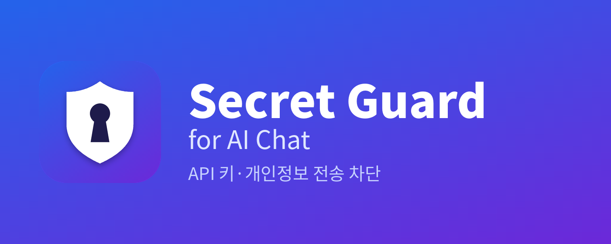

# Secret Guard for AI Chat

AI 채팅에 API 키, 비밀번호, 개인정보를 실수로 붙여넣는 순간 막아주는 크롬 확장입니다.
**모든 검사는 브라우저 안에서만** 이뤄지고, 어떤 데이터도 외부로 전송하지 않습니다.

> A Chrome extension that blocks API keys, passwords and personal data before they reach AI chats. Runs 100% locally. [English below](#english)



## 무엇을 막나요

| 입력 방식 | 동작 |
|---|---|
| 붙여넣기 (Ctrl+V) | 붙여넣기 자체를 차단 |
| 직접 타이핑 후 Enter | 전송 차단 |
| 전송 버튼 클릭 | 전송 차단 |
| 드래그 앤 드롭 | 차단 |
| 파일 첨부 | 아래 형식은 파일 내용을 읽어 검사 후 차단 |

**검사하는 첨부 파일**
- 문서: Word(.docx), Excel(.xlsx), PowerPoint(.pptx), PDF, 한글(.hwpx), OpenDocument(.odt/.ods/.odp)
- 텍스트: .txt, .csv, .log, .md, .json, .yaml, .env, .xml, 소스코드, 키 파일(.pem, id_rsa 등)
- 크기 제한: 텍스트 5MB, 문서·PDF 25MB (PDF는 앞 60쪽까지)

막혔을 때 **이번만 허용** 버튼을 누르면 15초 동안 검사를 건너뜁니다. 오탐일 때 쓰세요.

## 탐지 항목 (60여 종)

- **클라우드**: AWS, Alibaba Cloud, Tencent, GCP 서비스 계정, Google API/OAuth, Azure, DigitalOcean
- **개인키**: RSA/OpenSSH/PGP/PuTTY 개인키, kubeconfig client key
- **개발 도구**: GitHub, GitLab, npm, PyPI, Docker Hub, Vault, Terraform Cloud, Atlassian 등
- **SaaS**: OpenAI, Anthropic, Hugging Face, Stripe, Slack, Discord, SendGrid 등
- **접속 정보**: Bearer 토큰, JWT, DB 접속 문자열, 비밀번호가 포함된 URL, `password=...` 형태 할당
- **한국 개인정보**: 주민/외국인등록번호, 휴대폰, 운전면허, 여권, 사업자등록번호, 카드번호(Luhn 검증)

전체 목록과 정규식은 [`extension/patterns.js`](extension/patterns.js)에 있습니다.

## 지원 사이트

claude.ai, ChatGPT, Gemini, Microsoft Copilot (개인용 / 회사용 Microsoft 365 Copilot), DeepSeek, Perplexity, Mistral Le Chat, Grok (grok.com / X 안의 Grok), 뤼튼

> X 안의 Grok과 Microsoft 365 Copilot은 다른 메뉴에서 이동해 들어가면 확장이 안 켜질 수 있습니다. 해당 주소로 바로 열거나 페이지를 새로고침하세요.

## 설치

**웹스토어**: 심사 중 (등록 후 링크 추가)

**직접 설치 (개발자 모드)**
1. 이 저장소를 받아 압축 해제
2. 크롬에서 `chrome://extensions` → 우측 상단 **개발자 모드** 켜기
3. **압축해제된 확장 프로그램을 로드합니다** → `extension` 폴더 선택

엣지(`edge://extensions`), 웨일(`whale://extensions`)에서도 같은 방법으로 설치됩니다.

## 한계

실수 방지용 도구입니다. 아래는 막지 못합니다.
- 값을 쪼개거나 변형해서 입력하는 경우
- 이미지(스크린샷) 속 텍스트, 스캔한 PDF
- 구버전 한글(.hwp), 구버전 오피스(.doc/.xls/.ppt), 암호 걸린 파일, 압축 파일(.zip)
- 데스크톱 앱, IDE 플러그인, CLI 등 브라우저 밖의 AI 도구
- 사이트 UI가 바뀌어 전송 버튼을 인식하지 못하는 경우 (붙여넣기·Enter 차단은 계속 동작)

## 패턴 추가

`extension/patterns.js`의 `SECRET_PATTERNS` 배열에 한 줄 추가하면 됩니다.

```js
{ name: "사내 토큰", re: /\bmycorp_[0-9A-Za-z]{32}\b/ },
```

수정 후 `chrome://extensions`에서 확장의 새로고침(↻) 버튼을 누르고, 대상 탭도 새로고침하세요.

## 개인정보

어떤 데이터도 수집·저장·전송하지 않습니다. 네트워크 요청 코드 자체가 없습니다. [개인정보처리방침](docs/index.html)

## 사용한 오픈소스

PDF 텍스트 추출에 [Mozilla pdf.js](https://github.com/mozilla/pdf.js) (Apache-2.0)를 사용합니다. `extension/vendor/`에 포함되어 있으며 외부에서 받아오지 않습니다.

## 라이선스

MIT © 김의엽 (Kim Eui Yeob) · [rladmlduq47@gmail.com](mailto:rladmlduq47@gmail.com)

---

## English

Secret Guard stops you from accidentally pasting API keys, passwords, private keys and personal data into AI chats such as ChatGPT, Claude and Gemini.

- Blocks paste, Enter-to-send, send-button clicks, drag & drop, and file attachments: Word, Excel, PowerPoint, PDF, HWPX, OpenDocument and text files (`.env`, `.json`, source code, logs …)
- Detects 60+ secret types: AWS, GCP, Azure, Alibaba Cloud, GitHub/GitLab tokens, OpenAI/Anthropic keys, Stripe, Slack, JWTs, DB connection strings, private keys, credit cards (Luhn-checked) and Korean national ID numbers
- **"Allow once"** button to bypass for 15 seconds on false positives
- **100% local** — no network requests, no data collection, no analytics

It is a guard rail against mistakes, not a security boundary: split or obfuscated values, images, scanned PDFs, legacy .doc/.xls/.hwp files, and non-browser AI tools are not covered.

**Author**: Kim Eui Yeob · [github.com/kimeuiyeob](https://github.com/kimeuiyeob)

**Install from source**: open `chrome://extensions`, enable Developer mode, click *Load unpacked*, choose the `extension` folder.
